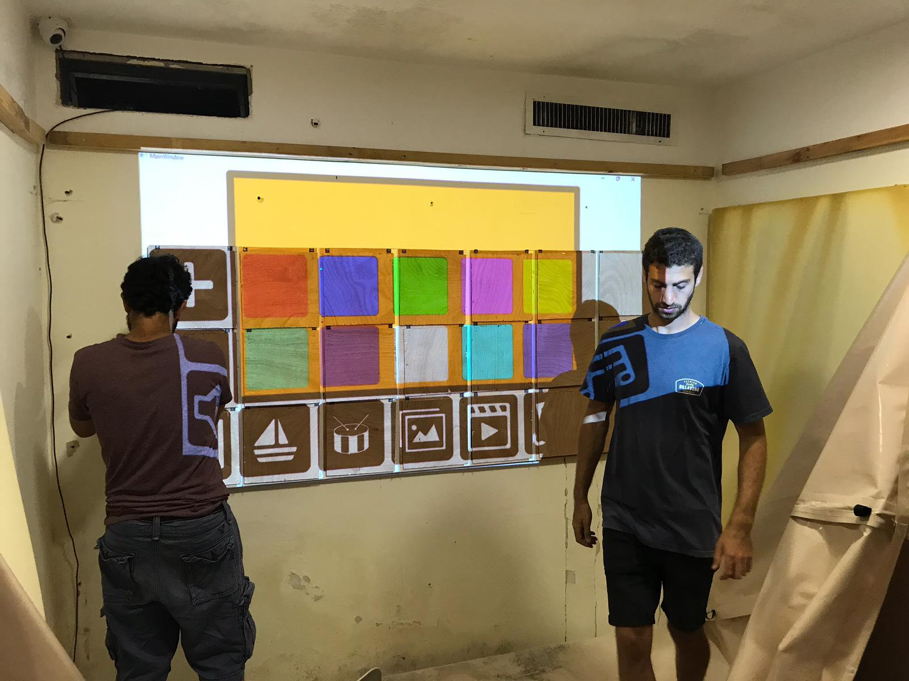
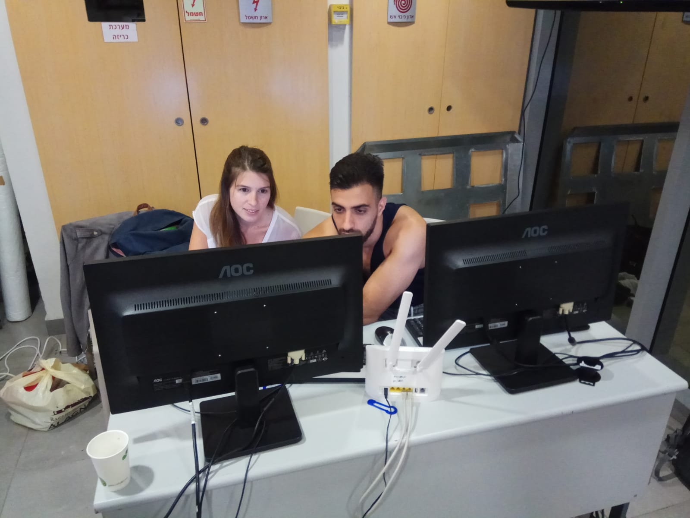
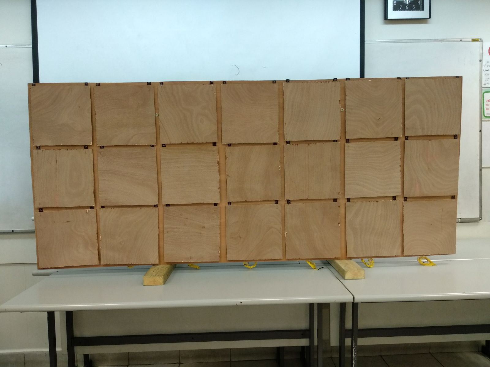
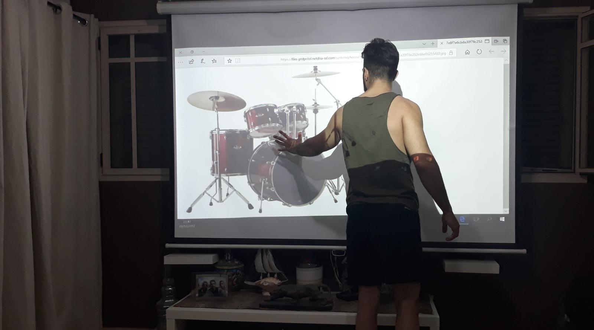
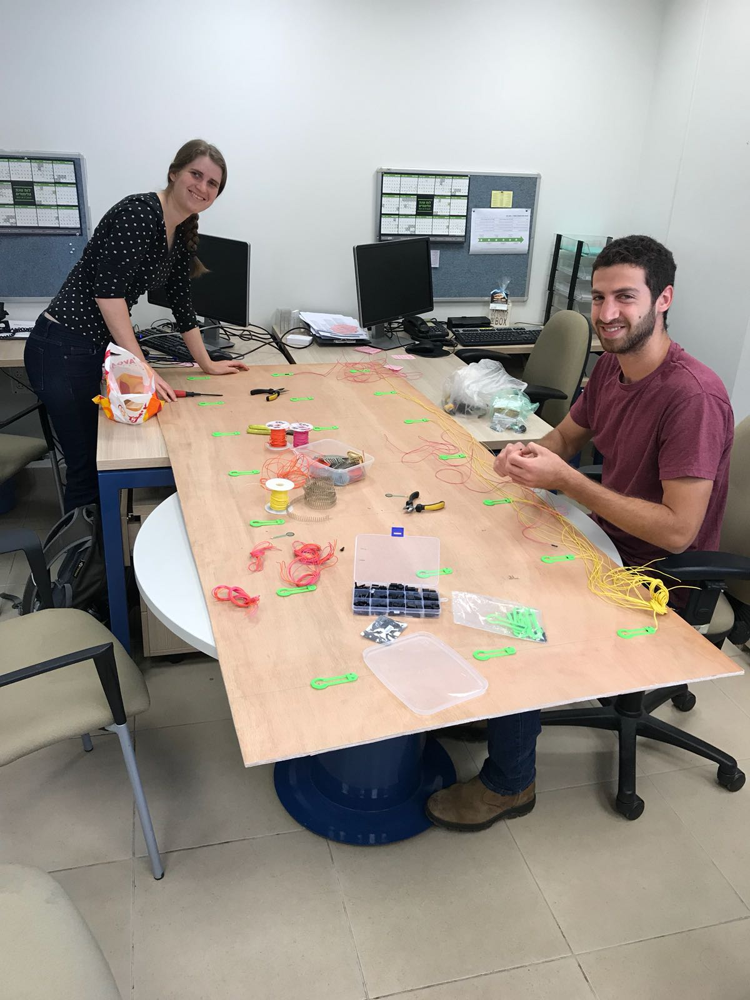
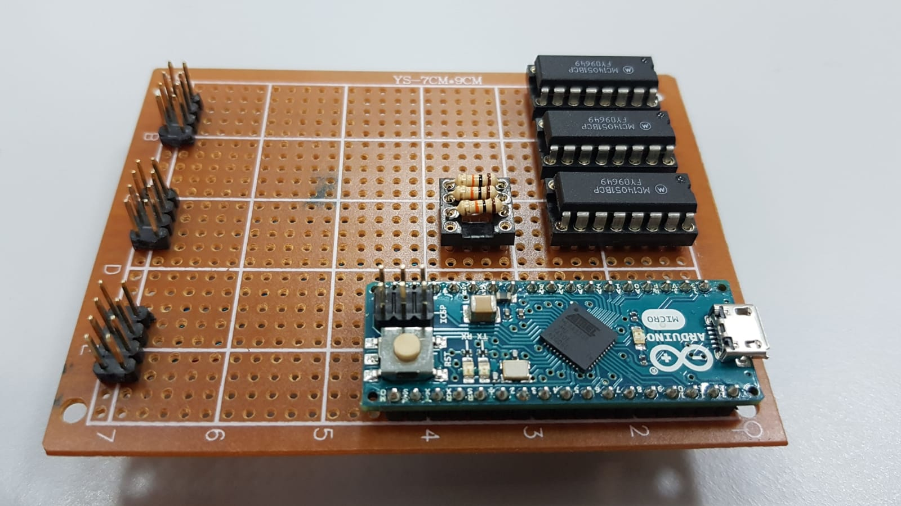

# Geha-Calming-Room
Interactive calming-room for patients in Geha. The system controlled by a self-designed touch-sensitive wall that allows patients to define a personalized calming environment. Alongside the calming atmosphere, the system also records the patients' activity for later analysis. most files are private

[Video](https://github.com/LiorItzhak/Geha-Calming-Room/raw/master/smartup-2018-nitzan-team.mp4)

[Video - Kid using the demo-alpha-room](https://github.com/LiorItzhak/Geha-Calming-Room/raw/master/smartup-2018-nitzan-team.mp4)

